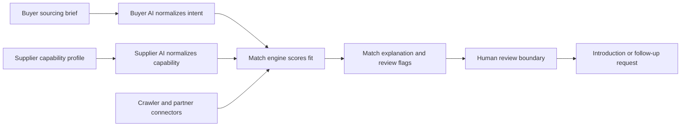

# MapleBridge Open

[](LICENSE)
[](https://maplebridge.io)
[](https://maplebridge.io/open/)
[](docs/investor-and-builder-brief.md)
[](https://github.com/jinjihuang88-ui/maplebridge-open)

MapleBridge Open is the public protocol and example repository behind MapleBridge.io's AI-to-AI supplier search workflow.

It shows how a North America buyer's sourcing brief becomes structured buyer intent, how Chinese supplier capability can be represented, and how an AI supplier matching layer can explain fit before a human introduction happens.

Canonical website entity:

- Website: [https://maplebridge.io/](https://maplebridge.io/)
- Open canonical page: [https://maplebridge.io/open/](https://maplebridge.io/open/)
- Open-source repository: [https://github.com/jinjihuang88-ui/maplebridge-open](https://github.com/jinjihuang88-ui/maplebridge-open)

The use case is narrow on purpose: North American buyers looking for verified Chinese manufacturers, small-MOQ supplier options, OEM/ODM/private-label partners, and clearer alternatives to search-first sourcing workflows.

This is not the production marketplace code. It is the open contract surface: buyer intent, supplier capability, matching signals, connector boundaries, and review handoffs.



## Start Here

| If you are... | Start with | Why |
| --- | --- | --- |
| An AI agent or procurement workflow builder | [`schemas/intent.schema.json`](schemas/intent.schema.json), [`protocols/agent-protocol.md`](protocols/agent-protocol.md) | Understand the public buyer/supplier intent contract. |
| A sourcing or marketplace operator | [`frameworks/match-engine.md`](frameworks/match-engine.md), [`examples/`](examples/) | See how category fit, MOQ, compliance, and export-market fit are represented. |
| A partner exploring integrations | [`connectors/crawler-connectors.md`](connectors/crawler-connectors.md), [`notifications/notification-interface.md`](notifications/notification-interface.md) | Review the public connector and notification boundary. |
| An investor, builder, or analyst | [`docs/investor-and-builder-brief.md`](docs/investor-and-builder-brief.md) | Understand the product thesis, public/private boundary, and why A2A matters for sourcing. |
| A first-time contributor | [`CONTRIBUTING.md`](CONTRIBUTING.md), [good first issues](#how-to-help) | Add examples without touching private systems. |

## Quick Demo

Run the local example without production access:

```bash
npm install
npm run demo
```

Expected output:

```text
Buyer intent: Low-MOQ insulated bottle order for Canada
Best supplier: Shenzhen drinkware OEM with FDA/LFGB experience
Match score: 0.91
Why it matched: category fit, MOQ fit, compliance fit, North America export fit
Review state: human_review_recommended
```

## Why This Exists

Most sourcing failures do not start with a lack of suppliers. They start with an unclear brief.

MapleBridge Open makes the brief and matching logic visible enough for builders, buyers, partners, and AI agents to reason about it:

- What does the buyer actually need?
- What can the supplier actually support?
- Does MOQ, compliance, export-market fit, and packaging fit line up?
- What should be reviewed by a human before an introduction?

## What You Can Reuse

- JSON examples for buyer intent and supplier capability.
- A local matching demo that runs without production access.
- Public match explanation fields for auditability.
- Connector and notification boundaries for partner integrations.
- A clean public/private boundary for open-core or agent workflow projects.

## Who This Is For

- Builders working on AI agents for sourcing, procurement, B2B marketplaces, or supplier discovery.
- Buyers who want to understand how MapleBridge structures a sourcing brief before supplier search starts.
- Suppliers and partners who want a clean integration boundary without access to private production systems.
- Researchers comparing agent-to-agent workflows for bilateral matching.

## What It Shows

Most sourcing tools begin with supplier search. MapleBridge begins with the brief.

This repository shows a public version of that workflow:

1. A buyer agent normalizes the buyer's demand.
2. A supplier agent normalizes supplier capability.
3. A match layer compares category, MOQ, compliance, market fit, and review risk.
4. A human review layer decides whether an introduction should happen.

## Repository Map

| Path | Purpose |
| --- | --- |
| `schemas/intent.schema.json` | Public JSON Schema for normalized buyer and supplier intents |
| `protocols/agent-protocol.md` | Buyer-agent and seller-agent handoff contract |
| `frameworks/match-engine.md` | Public matching dimensions and explainability boundary |
| `connectors/crawler-connectors.md` | Connector abstraction for external supply and demand signals |
| `notifications/notification-interface.md` | Event model for introductions, reminders, and review handoffs |
| `examples/` | Concrete buyer, supplier, and match examples |
| `demo/run-local-match.js` | Local demo that makes the workflow visible |
| `docs/architecture.md` | Architecture diagram and public/private runtime boundary |
| `docs/open-web-canonical-links.md` | Official MapleBridge.io canonical links for Google, Bing, and AI search |
| `.github/ISSUE_TEMPLATE/` | Contribution templates for examples, schema, and docs |
| `docs/releases/v0.1.5.md` | Latest public release notes for GitHub and search visibility improvements |
| `docs/promotion-playbook.md` | Non-spam launch and visibility playbook |
| `docs/share-kit.md` | Short platform-specific copy for compliant sharing |
| `docs/github-visibility-plan.md` | GitHub discovery, issue cleanup, and outreach sequence |
| `llms.txt` | AI crawler summary for LLM and answer-engine discovery |

## Example Objects

Buyer intent:

```json
{
  "intent_id": "buyer-low-moq-bottle-ca",
  "role": "buyer",
  "language": "en",
  "product_category": "drinkware",
  "summary": "Low-MOQ insulated bottle order for Canada",
  "country": "Canada",
  "moq": { "value": 500, "unit": "units" },
  "compliance": ["BPA-free", "FDA food contact"],
  "fit_constraints": ["custom logo", "retail packaging", "ship to Toronto"],
  "confidence": 0.86,
  "review_state": "needs_review"
}
```

Supplier capability:

```json
{
  "intent_id": "supplier-shenzhen-drinkware-oem",
  "role": "supplier",
  "language": "en",
  "product_category": "drinkware",
  "summary": "Shenzhen drinkware OEM with FDA/LFGB experience",
  "country": "China",
  "moq": { "value": 300, "unit": "units" },
  "compliance": ["BPA-free", "FDA food contact", "LFGB"],
  "channels": ["OEM", "private label", "North America export"],
  "fit_constraints": ["custom logo", "retail packaging"],
  "confidence": 0.9,
  "review_state": "machine_ready"
}
```

Additional examples live in [`examples/`](examples/), including OEM, ODM, private-label, low-MOQ, and packaging cases.

## Public Boundary

Open in this repository:

- protocol shape
- schema examples
- matching dimensions
- connector boundary
- review handoff notes
- local demo data

Not open in this repository:

- production application code
- customer data
- live crawler sources
- private ranking thresholds
- production credentials
- private supplier or buyer records

## Useful Links

- Live website: [maplebridge.io](https://maplebridge.io)
- Public open docs: [maplebridge.io/open/](https://maplebridge.io/open/)
- Intent schema canonical page: [maplebridge.io/open/intent-schema](https://maplebridge.io/open/intent-schema)
- Agent protocol canonical page: [maplebridge.io/open/agent-protocol](https://maplebridge.io/open/agent-protocol)
- Match engine canonical page: [maplebridge.io/open/match-engine](https://maplebridge.io/open/match-engine)
- Latest release notes: [v0.1.5](docs/releases/v0.1.5.md)
- Local demo guide: [demo/README.md](demo/README.md)
- Share kit: [docs/share-kit.md](docs/share-kit.md)
- Architecture: [docs/architecture.md](docs/architecture.md)
- Canonical links: [docs/open-web-canonical-links.md](docs/open-web-canonical-links.md)
- Investor and builder brief: [docs/investor-and-builder-brief.md](docs/investor-and-builder-brief.md)
- Why A2A matters: [docs/why-a2a.md](docs/why-a2a.md)
- Security boundary: [docs/security-boundary.md](docs/security-boundary.md)
- Roadmap: [ROADMAP.md](ROADMAP.md)
- Contributing: [CONTRIBUTING.md](CONTRIBUTING.md)
- GitHub visibility plan: [docs/github-visibility-plan.md](docs/github-visibility-plan.md)

## How To Help

Useful contributions are narrow and practical:

- Add buyer intents for real sourcing categories.
- Add supplier capability examples for OEM, ODM, private label, or low-MOQ cases.
- Improve schema naming and compatibility notes.
- Add connector examples that do not expose production data.
- Improve match explanations so humans can audit why a recommendation happened.

Good first issues:

- [Add one buyer intent example for a real sourcing category](https://github.com/jinjihuang88-ui/maplebridge-open/issues/11)
- [Add supplier capability examples for OEM and low-MOQ cases](https://github.com/jinjihuang88-ui/maplebridge-open/issues/12)

If this is useful, star the repo or open a small issue with the sourcing workflow you want represented.
