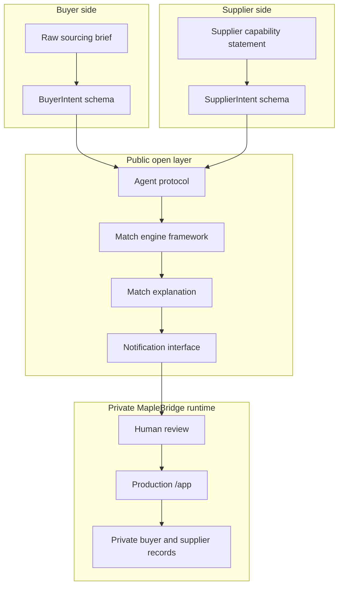

# MapleBridge Open Architecture

MapleBridge Open documents the public contract layer for AI-assisted bilateral B2B matching. The live marketplace and production app stay outside this repository.

## Public

- Intent shapes
- Agent handoff events
- Match dimensions
- Explanation fields
- Connector and notification boundaries
- Sample payloads and local demo data

## Private

- Production application code
- Live buyer and supplier records
- Production ranking weights
- Crawler seeds and source lists
- Credentials, prompts, and anti-abuse rules

## Canonical Web Pages

- Overview: https://maplebridge.io/open/
- Intent schema: https://maplebridge.io/open/intent-schema
- Agent protocol: https://maplebridge.io/open/agent-protocol
- Match engine: https://maplebridge.io/open/match-engine
- Sample payloads: https://maplebridge.io/open/sample-payloads
